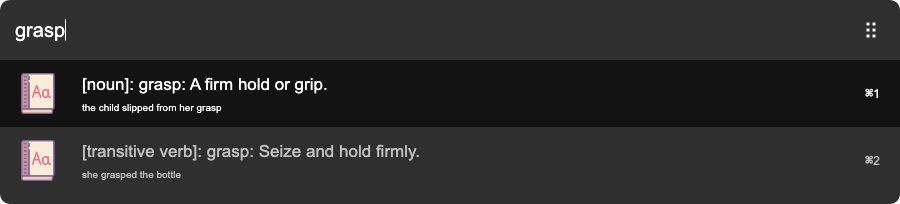

# arvis-freedict-plugin

Dictionary plugin for [Arvis](https://github.com/jopemachine/arvis) using dictionaryapi.dev



## Installation

```
$ npm i -g arvis-freedict-plugin
```

## Config

You can edit this plugin's config.

You can open the config file by typing or copy and paste `@config/arvis-freedict-plugin` to Arvis.

You can edit this plugin's config.

### lang

type: `string`

default value: `en_US`


## Icon sources

This plugin uses below icon sources

<a target="_blank" href="https://icons8.com">Image</a> icon by <a target="_blank" href="https://icons8.com">Icons8</a>
