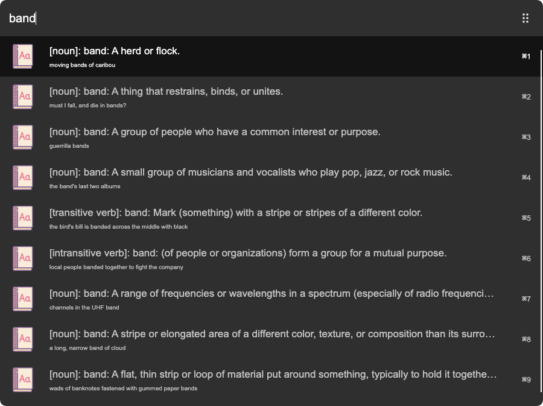
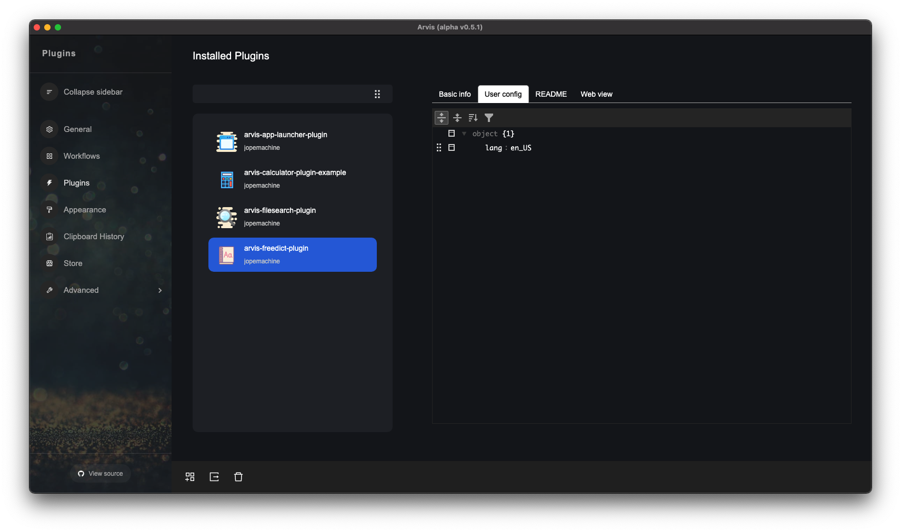

# arvis-freedict-plugin

[](https://www.codefactor.io/repository/github/jopemachine/arvis-freedict-plugin)
[](http://badge.fury.io/js/arvis-freedict-plugin)
[](https://lbesson.mit-license.org/)
[](http://makeapullrequest.com)
[](https://GitHub.com/jopemachine/arvis-freedict-plugin/issues/)

Dictionary plugin for [Arvis](https://github.com/jopemachine/arvis) using [dictionaryapi.dev](https://dictionaryapi.dev/)




## Installation

```
$ npm i -g arvis-freedict-plugin
```

## Config

You can edit this plugin's config on `User config table` like below.



### lang

type: `string`

default value: `en_US`

## Icon sources

This plugin uses below icon sources

<a target="_blank" href="https://icons8.com">Image</a> icon by <a target="_blank" href="https://icons8.com">Icons8</a>

## Related

- [dictionaryapi.dev](https://dictionaryapi.dev/) - API for this module.

- [arvish](https://github.com/jopemachine/arvish) - Arvis workflow, plugin creator tools

- [other plugins](https://github.com/jopemachine/arvis/blob/master/documents/plugin-links.md)
